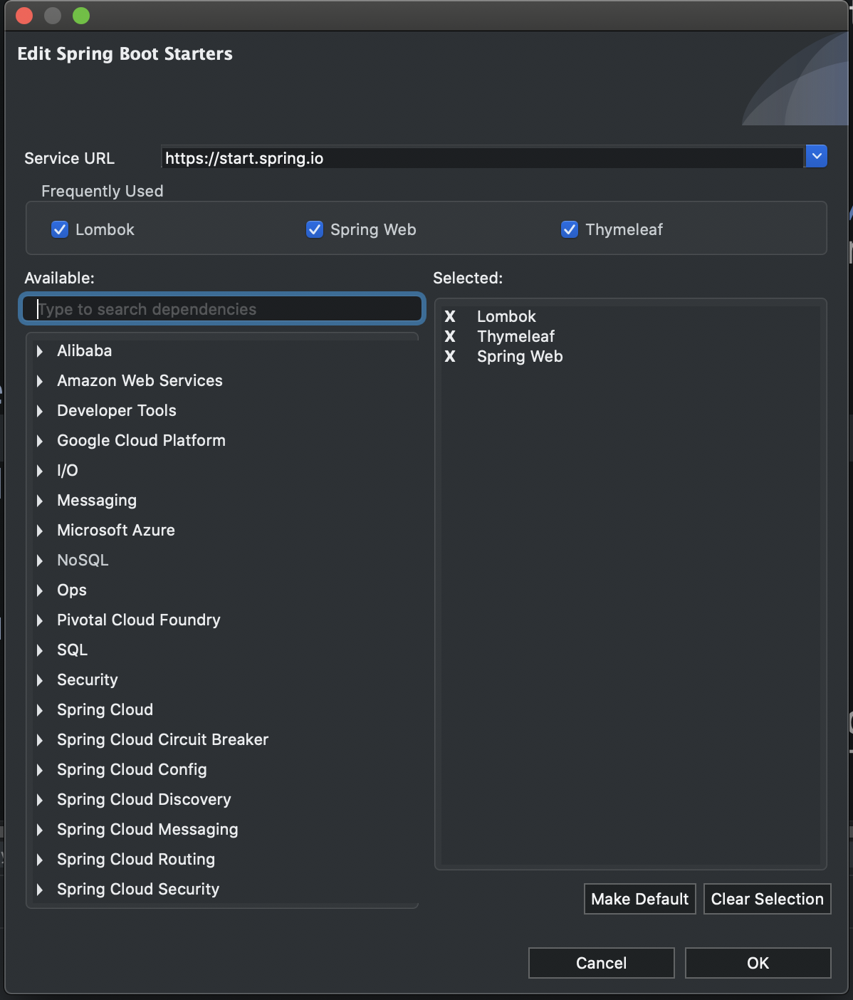
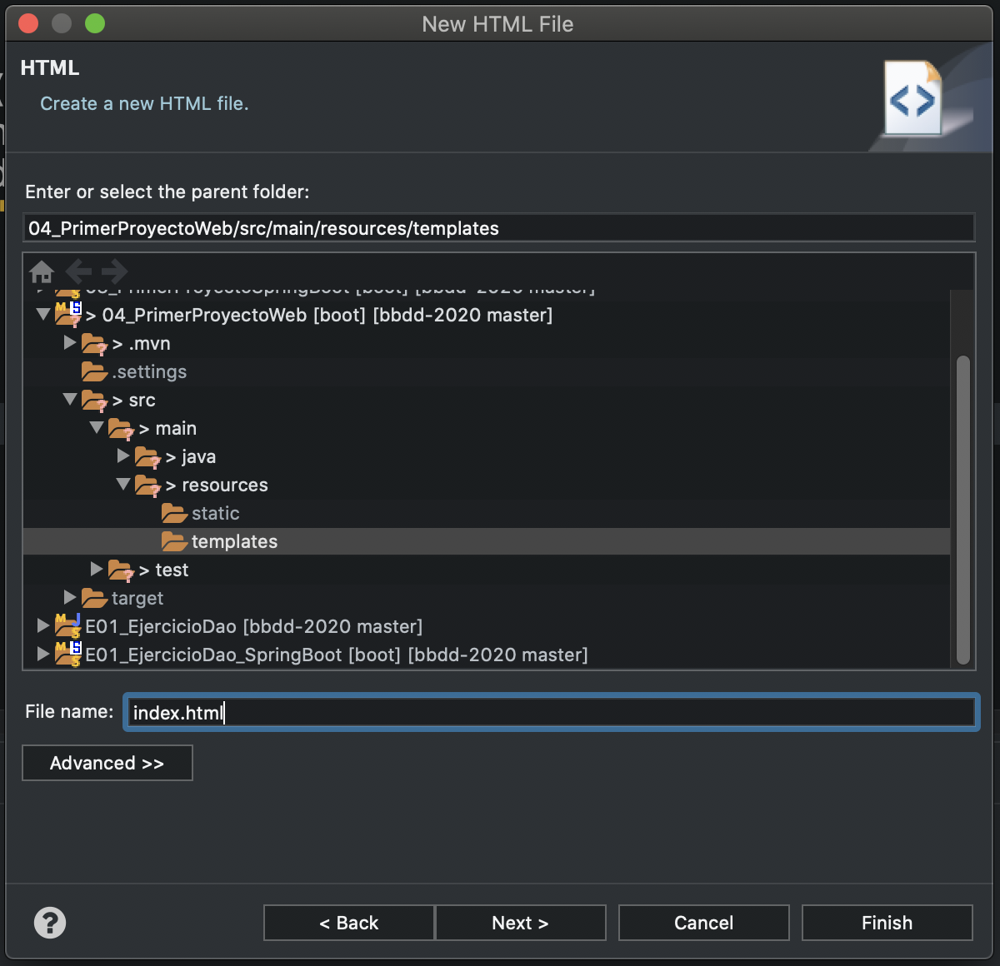

# Primer proyecto web con Spring Boot

En este ejemplo se puede ver cómo crear una aplicación web, tipo _Hola Mundo_, con Spring Boot y Thymeleaf.

## Creación del proyecto

Para crearlo, hemos utilizado el asistente que encontramos en File > New > Spring Starter Project. Hemos añadido las siguientes dependencias (las hemos añadido a través de dicho asistente):




Y este es el resultado en el `pom.xml`:

```xml
<dependencies>
		<dependency>
			<groupId>org.springframework.boot</groupId>
			<artifactId>spring-boot-starter-thymeleaf</artifactId>
		</dependency>
		<dependency>
			<groupId>org.springframework.boot</groupId>
			<artifactId>spring-boot-starter-web</artifactId>
		</dependency>

		<dependency>
			<groupId>org.projectlombok</groupId>
			<artifactId>lombok</artifactId>
			<optional>true</optional>
		</dependency>
		<dependency>
			<groupId>org.springframework.boot</groupId>
			<artifactId>spring-boot-starter-test</artifactId>
			<scope>test</scope>
			<exclusions>
				<exclusion>
					<groupId>org.junit.vintage</groupId>
					<artifactId>junit-vintage-engine</artifactId>
				</exclusion>
			</exclusions>
		</dependency>
	
	</dependencies>

```

A partir de esto, podemos observar que estamos creando un proyecto _web_, cuyo _motor de plantillas será Thymeleaf_, y que hará uso de _Project Lombok_.

## Estructura del código

Este proyecto es muy sencillo, y la estructura del código así lo refleja.

### Código Java

Tendremos solamente dos paquetes:

* `com.salesianostriana.dam.primerproyectoweb`: es el paquete raíz, que incluye la clase principal.
* `com.salesianostriana.dam.primerproyectoweb.controladores`: paquete que va a incluir la clase controladora.

### Plantillas de Thymeleaf

Todas nuestras plantillas de Thymeleaf (que son ficheros con extensión `.html`) se almacenan en la ruta `/src/main/resources/templates`.

## Controlador

Un controlador es una clase que se encargará de realizar dos acciones muy concretas: 

- Recibir peticiones por parte del usuario; en nuestro caso, a través de un cargar una determinada URL en un navegador web.
- Derivar esas peticiones hacia quién corresponda; por ejemplo, al motor de plantillas para que se procese y sea devuelta al usuario.

En Spring, un controlador es una clase anotada con el estereotipo `@Controller`. Esto nos da mucha libertad, ya que en otros frameworks los controladores extienden a una clase concreta, o deben implementar algún tipo de interfaz específica. 

### Métodos en el controlador

En Spring, un método de un controlador sirve, usualmente, para atender una petición HTTP a una dirección concreta. Para asocir un método a un tipo de petición (GET, POST, ..) y dirección URL concreta, se pueden usar las siguientes anotaciones:

- `@GetMapping("ruta/de/la/peticion")`: para peticiones GET
- `PostMapping("ruta/de/la/peticion")`: para peticiones POST
- y `XXXMapping("...")` para peticiones XXX (PUT, PATCH, DELETE, ...)

La estructura más usual de los métodos de controlador que utilizaremos en nuestros proyectos con Thymeleaf será la siguiente:

```java
    public String nombreDelMetodo(Model model) {
        // resto del código
        return "plantilla";
    }
```

- El nombre del método no es importante para Spring, es decir, podemos poner el que más adecuado para nuestro proyecto según nuestro criterio.
- No es obligatorio que reciba ningún argumento, aunque es habitual que reciba uno de tipo `org.springframework.ui.Model`. Este argumento es un contenedor que nos permitirá pasar variables a la plantilla.
- Normalmente, el tipo de retorno será `String`. El valor que se devuelve es el nombre de la plantilla, a sabiendas de que Spring le concatena un prefijo y un sufijo:
    - Como prefijo, la ruta base de las plantillas `/src/main/resources/templates`
    - Como sufijo, la extensión `.html`

### Resultado del controlador

Si metemos los elementos anteriores en la coctelera, tenemos el siguiente código Java:

```java
@Controller
public class MainController {
	
	@GetMapping("/")
	public String index(Model model) {
		model.addAttribute("mensaje", "Hola Mundo");
		return "index";
	}

}
```

Se trata de un controlador con las siguientes características:

- Tiene un solo método
- Está mapeado a la ruta `/` para hacer peticiones GET. Con lo cual, será invocado cuando escribamos esta ruta en el navegador (siempre hay que pensar que tenemos que añadir la ruta base, que en local es `http://localhost:8080`)
- Queremos pasarle a la plantilla un objeto, de tipo `String`, llamado `mensaje`, y cuyo contenido es `Hola Mundo`.
- Lo que le devolvemos al usuario (para que el navegador web lo pueda _pintar_) es la plantilla `index`, cuya ruta completa será `/src/main/resources/templates/index.html`.


## Plantilla

Thymeleaf es un motor de plantillas para HTML (entre otros) que nos permitirá definir un documento HTML con unas _marcas_ especiales, que pueden ser sustituidas por una serie de valores (en Spring, estos valores se reciben a través de los controladores).

En Spring Tool Suite no hay un asistente específico para crear plantillas de Thymeleaf; nos bastará con crear un documento HTML. Se deben guardar siempre en la ruta `/src/main/resources/templates`.




* Para indicar que es una plantilla de Thymeleaf, tenemos que añadir el espacio de nombres a la etiqueta HTML:

```html
<html xmlns:th="http://www.thymeleaf.org">
```

* En este ejemplo no vamos a entrar a añadir elementos complejos de HTML, CSS o Bootstrap. Tan solo vamos a añadir una etiqueta de tipo `<h1>` para mostrar un mensaje de saludo. Todas las etiquetas de Thymeleaf son iguales que las etiquetas de html, pero con el prefijo `th` en sus propiedades. Esto nos permite crear plantillas fácilmente.

```
<h1 th:text="">Un saludo</h1>
```

Para indicar que el mensaje que queremos renderizar, tenemos que proporcionar una variable a la propiedad `th:text`. Esta variable viene del controlador, en particular de esta línea:

```java
model.addAttribute("mensaje", "Hola Mundo");
```

En Thymeleaf tenemos un lenguaje de expresiones que iremos aprendiendo, y que suele usar la sintaxis `${}`. Dentro de las llaves puede haber, por ejemplo, el nombre de una variable. De esta forma, la expresión:

```html
<h1 th:text="${mensaje}">Un saludo</h1>
```

al ser procesadar por el motor de plantillas, va a sustituir `${mensaje}` por su contenido, de forma que el código HTML resultante sería:

```html
<h1>Hola Mundo</h1>
```

Aquí el código completo de la plantilla:

```html
<html xmlns:th="http://www.thymeleaf.org">
<head>
<meta charset="UTF-8">
<title>Insert title here</title>
</head>
<body>
	<h1 th:text="${mensaje}">Un saludo</h1>
</body>
</html>
```