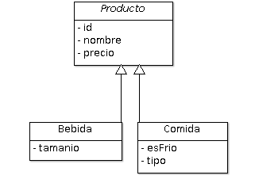

# Ejemplo 15 - Herencia de tipo MappedSuperclass

## Algo de teoría: herencia

La herencia es un mecanismo de la Orientación a Objetos que nos permite indicar que dos objetos tienen un tipo de asociación especial, llamada _es-un_. De esta forma, creamos una clase a partir de otra.

JPA nos ofrece varios mecanismo para poder implementar la herencia, que nos servirán en función del problema a resolver y el resto de asociaciones que tengan las entidades:

- _Mapped SuperClass_: nos permite utilizar una clase como base para su extensión, pero esta clase no será mapeada a la base de datos.
- _Single Table_: se traslada la jerarquía de herencia como una sola tabla, utilizando una columna como _discriminante_.
- _Joined_: se traslada una tabla para cada una de las clases de la jerarquía de la entidad, realizandose operaciones join.
- _Table Per Class_: se traslada una tabla para cada una de las clases de la jerarquía de la entidad, pero sin uso de operaciones join.

En este ejemplo ilustraremos el uso del primero de ellos.


## Herencia con `@MappedSuperclass`

Utilizaremos este primer tipo de herencia en aquellas situaciones en que **tengamos más de una entidad que herede de una clase base, pero no necesitemos que esta sea una entidad**. Es decir, si se da la circunstancia de que una serie de entidades comparten algunos atributos, y queremos tener estos en una clase base, pero esta (siendo o no abstracta) no queremos gestionarla como entidad (es decir, no vamos a hacer consultas sobre ella, no estará asociada con otra entidad, ...) podemos utilizar este tipo de herencia.

Sea el diseño de clases de nuestro ejemplo:

 

En este caso, la clase base `Producto` es abstracta, y no queremos mapearla como entidad. En tal caso, podemos utilizar la anotación `@MappedSuperclass`:

```java
@NoArgsConstructor
@MappedSuperclass
public abstract class Producto {
	
	@Id
	@GeneratedValue(strategy = GenerationType.AUTO)
	private long id;
	
	private String nombre;
	
	private float precio;
	
	public Producto(String nombre, float precio) {
		this.nombre = nombre;
		this.precio = precio;
	}
}
```

Como podemos observar, aunque no sea una entidad, podemos utilizar las anotaciones `@Id` y las complementarias, para establecer que uno de los atributos comunes a las dos clases derivada, `Bebida` y `Comida`, será la clave primaria.

> Como es una clase abstracta, no necesita todas las anotaciones de lombok que venimos utilizando hasta ahora. Tan solo añadimos `@NoArgsConstructor`, para que las clases derivadas también la puedan utilizar.

## Clases extendidas

El diseño de las clases extendidas sería como sigue:

```java
@Getter @Setter @NoArgsConstructor
@EqualsAndHashCode(callSuper = true)
@ToString(callSuper = true)
@Entity
public class Bebida extends Producto{

	// Tamaño de la bebida expresado en centilitros
	private int tamanio;

	public Bebida(String nombre, float precio, int tamanio) {
		super(nombre, precio);
		this.tamanio = tamanio;
	}	
}
```

```java
@Getter @Setter @NoArgsConstructor
@EqualsAndHashCode(callSuper = true)
@ToString(callSuper = true)
@Entity
public class Comida extends Producto {
	
	private boolean esFrio;
	
	private String tipo;
	
	public Comida(String nombre, float precio, boolean esFrio, String tipo) {
		super(nombre, precio);
		this.esFrio = esFrio;
		this.tipo = tipo;
	}

}
```

De las clases extendidas podemos observar:

- Como es natural, extienden la clase base, `Producto`.
- Definen un constructor con argumentos (todos, salvo el marcado con `@Id`) que necesita del constructor de la clase base (invocado con `super`).
- No tienen las anotaciones de lombok tal y como las venimos usando hasta ahora (abundamos sobre ello más adelante).

Al ejecutar el proyecto, vemos que el DDL generado es:

```sql
create table bebida (
	id bigint not null, 
	nombre varchar(255), 
	precio float not null, 
	tamanio integer not null, 
	primary key (id)
)

create table comida (
	id bigint not null, 
	nombre varchar(255), 
	precio float not null, 
	es_frio boolean not null, 
	tipo varchar(255), 
	primary key (id)
)

```

Es decir, cada una de las entidades _hijas_ reciben los atributos de la clase base y lo incorporan a su esquema.


## Repositorios y servicios

Para esta solución, hay que tener en cuenta que:

- **No hay que crear ni repositorio ni servicio de la clase anotada con `@MappedSuperclass`**
- Sí que creamos repositorios y servicios para las clases _hijas_, que son entidades.


## Una palabra sobre Lombok

Al utilizar algunas anotaciones de lombok con herencia, podemos tener una pequeña dificultad. Y es que por defecto, las anotaciones `@EqualsAndHashcode` y `@ToString` tienen una propiedad, llamada `callSuper` establecida a `false`.

Para solucionarlo, realizamos lo siguiente:

- _Deconstruir_ la etiqueta `@Data` en sus componentes: `@Getter`, `@Setter`
- Añadir como en otras ocasiones `@NoArgsConstructor`
- Para los métodos `equals`, `hashCode` y `toString` tenemos dos soluciones:
	- Implementarlos a mano (lo cual es altamente recomendable, ya que nos permitirá afinar al máximo el resultado)
	- Utilizar las anotaciones `@EqualsAndHashcode` y `@ToString`, estableciendo en ambas la propiedad `callSuper = true`. De esta manera, a nivel interno, se utilizan los métodos `equals`, `hashCode` y `toString` de la clase base en la implementación de dichos métodos en la clase hija.
	
Para más información se puede consultar el siguiente [enlace](https://projectlombok.org/features/EqualsAndHashCode).